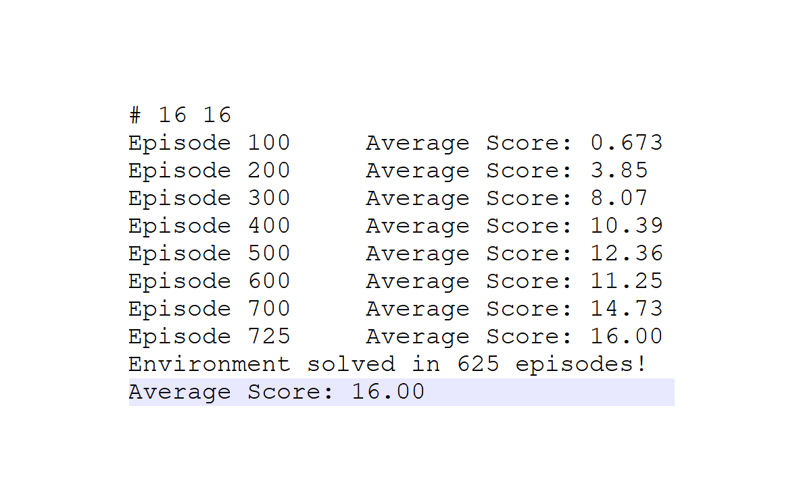
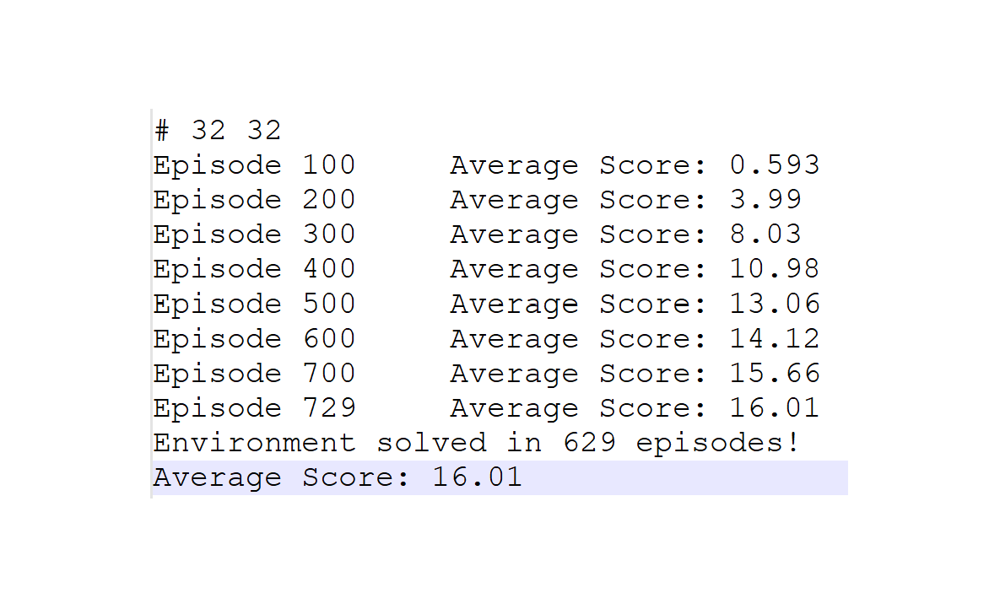

# Project Report

## Learning Algorithm
The learning algorithm used to implement this project contains the following features:
* Instead of a simple Q table a deep neural network is applied (DQN).
* Experience replay and fixed Q-targets are used to stabilize the training of the DQN.
* Additionally, prioritized experience replay was implemented to learn more effectively.

A DQN model consisting of two linear hidden layers each having 16 neurons and
an output layer with 4 neurons provided the best performance as is discussed
in the next section.

For learning the agent the following hyperparameters where used:
* alpha: 0.5
* beta_start: 0.5
* beta_increase: 0.9995
* beta_end: 1.0
* epsilon_start: 1.0
* epsilon_decay: 0.995
* epsilon_end: 0.01
* n_episodes: 2000
* max_timesteps: 1000
* gamma: 0.99
* tau: 1.0E-3
* update_every: 4
* learning_rate: 5.0E-4
* buffer_size: 10000
* batch_size: 64
* scores_window: 100
* hidden_sizes: [16, 16]

Details about the meaning of each hyperparameter can be found in the file 
config.yml.

## Plot of Rewards
Several architectures and hyperparameters were tested to find an agent with high performance.
As can be seen in the plot blow, increasing complexity of the DQN does not mean that the training 
becomes more effective. The figure shows four attempts of four DQNs which solved the environemnt,
each having two hidden layers but different amounts of neurons. The label indicates the number of 
neurons in each hidden layer. The scores where increasingly order, thus they don't display the
order of attempts.

The following figure shows the reward plots of the most effective DQNs.

  
  
  

  <em> Reward plots for a 16-16 DQN, 32-32 DQN and 64-64 DQN (from left to right) </em>

The correspoding training outputs are shown below:

  
  
  

  <em> Training outputs of a 16-16 DQN, 32-32 DQN and 64-64 DQN (from left to right) </em>

## Ideas for Future Work
Ideas for further optimizations are summarized in the following list:
* Dueling DQN [arxiv](https://arxiv.org/abs/1511.06581)
* Distributional DQN [arxiv](https://arxiv.org/abs/1707.06887)
* Noisy DQN: [arxiv](https://arxiv.org/abs/1706.10295)
* Asynchronous Methods for Deep Reinforcement Learning: [arxiv](https://arxiv.org/abs/1602.01783)
* Combining all improvements in Deep Reinforcement Learning (Rainbow): [arxiv](https://arxiv.org/abs/1710.02298)
